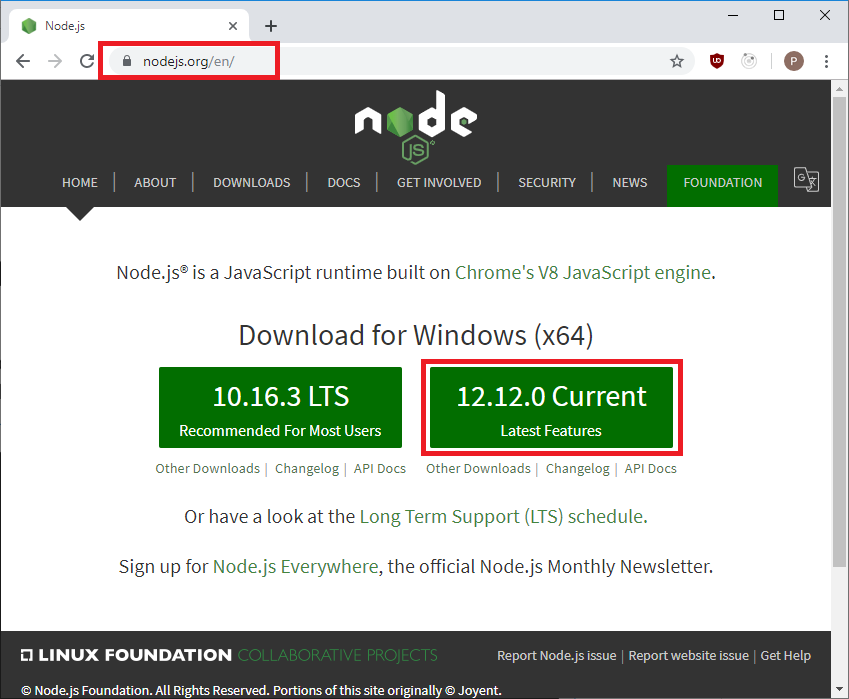
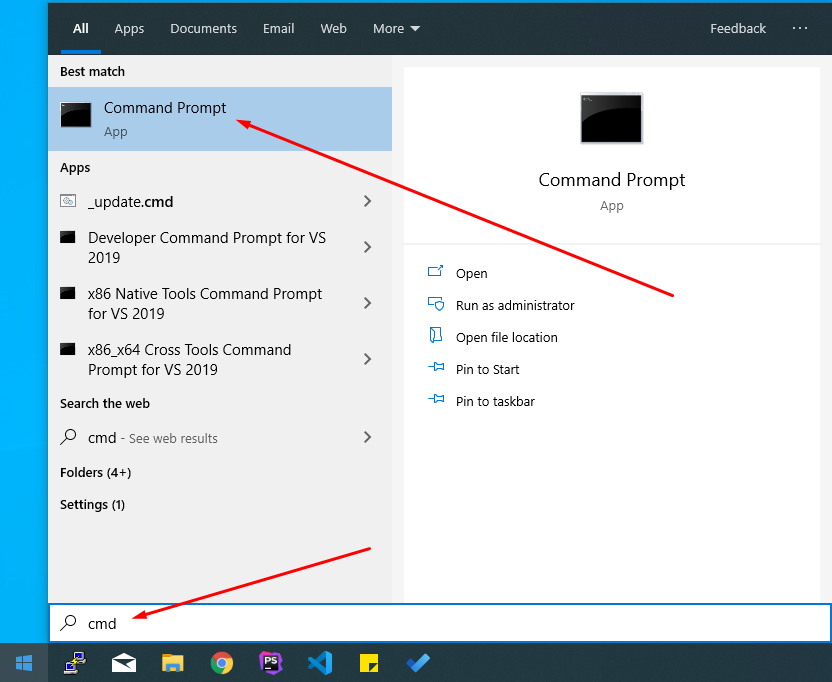
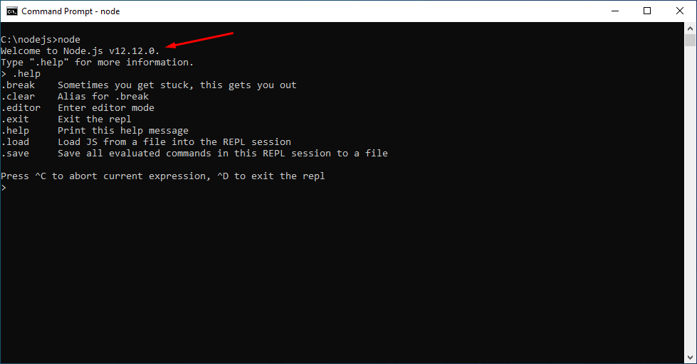
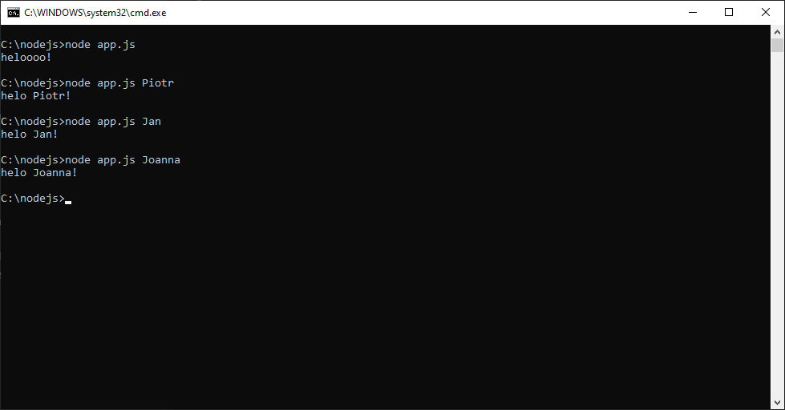

# Node.js - Laboratorium 1

## Wykład

https://slides.com/piotrtarasiuk/nodejs-basic

## NodeJS

Aby rozpocząć przygodę z NodeJS należy pobrać i zainstalować najnowszą wersję NodeJS z oficjalnej strony https://nodejs.org. Krok po kroku postępujemy zgodnie z instalatorem.

> Trzeba pamiętać o wybraniu wersji dedykowanej na nasz system operacyjny!

Jeżeli wszystko przebiegło pomyślnie, powinniśmy zweryfikować czy wszystko działa poprawnie. W naszym terminalu/konsoli powinniśmy wpisać polecenie `node`. Spowoduje to uruchomienie NodeJS.

> Aby wyjść z NodeJS wpisz polecenie `.exit` lub dwukrotnie naciśnij kombinację klawiszy `ctrl + c`.

> Jeżeli chcemy uruchomić skrypt napisany w JavasScript należy wykonać polecenie `node nazwa_pliku.js`.

## Przydatne linki

`NodeJS`: https://nodejs.org

Dokumentacja `NodeJS`: https://nodejs.org/dist/latest-v12.x/docs/api/

## Zadania do wykonania na laboratorium

1. Zadaniem jest stworzenie aplikacji która podczas uruchomienia przywita nas. Aplikacja ma być uruchamiana z poziomu konsoli. (`node ...`).

2. Stwórzmy aplikację składającą się z 2 plików(`app.js` oraz `user-name.js`) która wyświetli przywitanie osoby. Plik `app.js` odpowiedzialny jest za wczytanie pliku `user-name.js` i wyświetlenie w konsoli `heloo name!`, gdzie `name` to wartość z pliku `user-name.js`.

3. Rozszerzmy zadanie 2 tak by nasz plik `user-name.js` zwracał imię oraz nazwisko jako oddzielne zmienne. W `app.js` wyświetlmy przywitanie osoby.

4. Stwórzmy prosty kalkulator(dodawanie, odejmowanie, dzielenie oraz mnożenie). Aplikacja powinna składać się z 2 plków(główna aplikacja `app.js` oraz `math.js` zawierający odpowiednie funkcje).

5. Dodajmy do naszego kalkulatora zmienną matematyczną `PI` i wypiszmy ją na konsoli w naszej głównej aplikacji.

6. Wykorzystując wbudowany moduł w `NodeJS` zapiszmy wynik naszego działania z zadania 5 do pliku. W tym zadaniu posłużymy się modułem `fs`(https://nodejs.org/dist/latest-v12.x/docs/api/fs.html).

> Pobawmy się funkcjami `writeFileSync`, `appendFileSync` oraz 
`readFileSync`

7. Stwórzmy aplikację która wyświetli nam informację o zalogowanym użytkowniku systemu. W tym celu powinniśmy się zapoznać z wbudowanym modułem `os`(https://nodejs.org/dist/latest-v12.x/docs/api/os.html). Wczytaną nazwę użytkownika zapiszmy do pliku na dysku.

8. Zabawa z parametrami wejściowymi. Podczas uruchamiania aplikacji możemy przekazać coś do naszej aplikacji. 

Globalna zmienna `process` zawiera informacje z jakimi parametrami nasza aplikacji została uruchomiona. Wpisując w konsoli `node app.js Piotr`, zmienna `process.argv` będzie zawierała w sobie dodatkowe informacje.

Zadaniem jest stworzenie aplikacji która w przypadku podania dodatkowego parametru przywita podaną osobę, jeżeli nie zostanie podany dodatkowy parametr aplikacja powinna wyświetlić powitanie anonimowe.

Dla przykładu:

9. Dodajmy do naszej aplikacji z zadania 8 zapis do pliku naszego przywitania.
