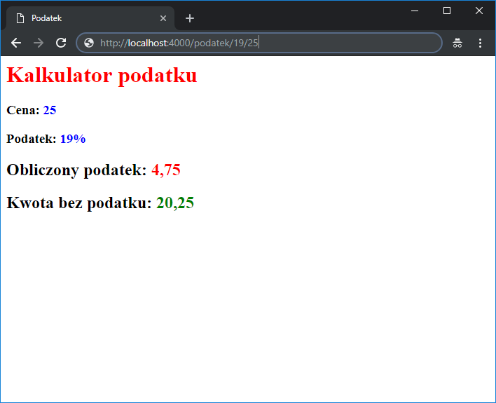

# Node.js - Laboratorium 10

## `templates` (https://expressjs.com/en/guide/using-template-engines.html)

### `application`
```javascript
// npm install pug

const express = require('express');
const app = express();

app.set('view engine', 'pug')
    app.get('/', function (req, res) {
        const scope = { title: 'some title', header: 'heloo!' };
        res.render('index', scope);
    });

app.listen(4000, () => console.log('start server'));
```
### `template pug(views/index.pug)`
```pug
   html
        head
            title= title
        body
            h1= header
```

## `error handling` (https://expressjs.com/en/guide/error-handling.html)

### Łapanie wyjątków synchronicznych
```javascript
const express = require('express');
const app = express();

app.get('/', (req, res) => {
    throw new Error('getting error');
});

app.use((error, req, res, next) => {
    // ...
});

app.listen(4000, () => console.log('start server'));

```

### Łapanie wyjątków asynchronicznych
```javascript
const express = require('express');
const app = express();

app.get('/timeout', (req, res, next) => {
    setTimeout(function () {
        try {
            throw new Error('some error!');
        } catch (err) {
            next(err);
        }
    }, 100);
});

// lub

app.get('/async', (req, res, next) => {
    readFileAsync('./plik.txt')
        .then(res.send)
        .catch(next);
});

// lub

app.get('/async2', async (req, res, next) => {
    try {
        const data = await readFileAsync('./plik.txt')
        res.send(data);
    } catch (error) {
        next(error);
    }
});

app.use((error, req, res, next) => {
    // ...
});

app.listen(4000, () => console.log('start server'));
```

#### `'global' exception handler`
```javascript
const express = require('express');
const app = express();

const fs = require('fs');
const util = require('util');
const readFileAsync = util.promisify(fs.readFile);

const exceptionHandler = fn => {
    return async (req, res, next, ...args) => {
        try {
            await fn(req, res, next, ...args);
        } catch (error) {
            next(error);
        }
    }
}

app.get('/async3', exceptionHandler(async (req, res, next) => {
    const data = await readFileAsync('./plik.txt')
    res.send(data);
}));

app.use((error, req, res, next) => {
    // ...
});

app.listen(4000, () => console.log('start server'));
```

## Zadania do wykonania na laboratorium

1. Stwórzmy nasz pierwszą aplikację serwerową wykorzystującą system szablonów `PUG`. Obsłużmy ścieżki takie jak:
```
'/' - wyświetli przywitanie 'hello world!' jako nagłówek ('h1')
'/Jan' - wyświetli przywitanie 'hello Jan!' jako nagłówek ('h1')
'/Adam' - wyświetli przywitanie 'hello Adam!' jako nagłówek ('h1')
...
```

2. Przećwiczmy wczytywanie szablonów zmieniając system szablonów `PUG` na `MUSTACHE`(https://github.com/bryanburgers/node-mustache-express). Stwórzmy aplikację, która wyliczy nam podatek z podanej kwoty i zwróci nam widok z danymi.

> Przykład ścieżki `/podatek/19/25`, gdzie `19` to wysokość vat podana w procentach oraz `25` kwota.

>Przykład widoku:



3. Stwórzmy aplikację, która będzie dzieliła dwie liczby. W przypadku dzielenia przez `0`, aplikacja ma rzucić wyjątkiem. Dodajmy do naszej aplikacji `middleware`, który wyświetli w konsoli informacje o wystąpieniu błędu.

4. Stwórzmy WEB API które wczyta podany plik(asynchronicznie!) i wyśle zawartość do użytkownika końcowego. W katalogu `04/static` zostały dodane przykładowe pliki.

> Scenariusz 1: ścieżka: `/music.txt` - wczytaj zawartość pliku i wyślij do użytkownika

> Scenariusz 2: ścieżka: `/movies.txt` - wyrzuci błąd

> Scenariusz 3: ścieżka: `/sample.txt` - wczytaj zawartość pliku i wyślij do użytkownika


5. Dodajmy do zdania 4 `middleware` obsługujący błąd i wyświetlmy swoją stronę z błędem. W zadaniu wykorzystajmy system szablonów `mustache`

6. Kolejnym zadaniem jest stworzenie aplikacji pozwalającej na jednocześnie pobranie danych użytkownika oraz pogody. Pamiętajmy o obsłudze błędów zewnętrznych API.

> Przykład adresu: `http://localhost:4000/user/2`

> Adres do pobierania użytkownika: https://jsonplaceholder.typicode.com/users/2

> Adres do pobierania pogody: https://api.openweathermap.org/data/2.5/weather?appid=0ed761300a2725ca778c07831ae64d6e&lat={LAT}&lon={LNG}