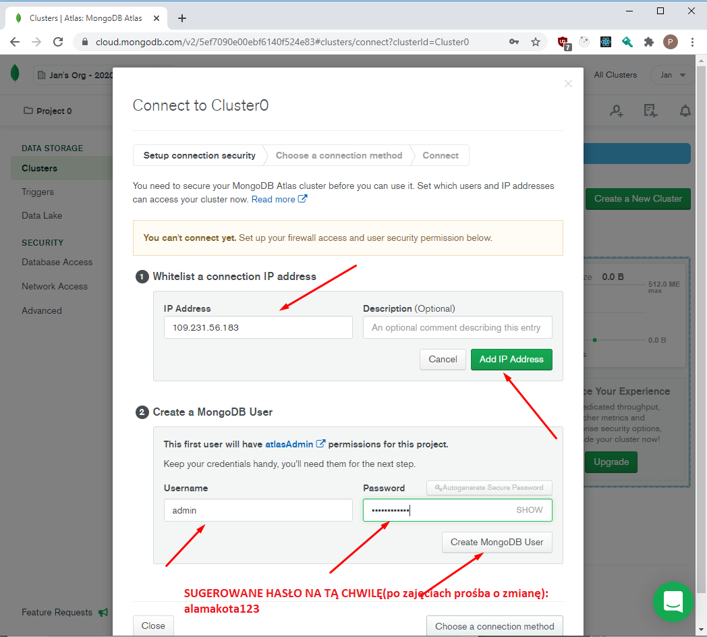

# Node.js - Laboratorium 11

## `MongoDB` (https://www.mongodb.com/)

Program który uruchamia serwer bazy danych z podaniem ścieżki do katalogu:
```
c:/mongodb/bin/mongod --dbpath c:/mongodb-data
```

## `MongoDB Node.JS Driver` (https://mongodb.github.io/node-mongodb-native/?jmp=docs)

> Reference: http://mongodb.github.io/node-mongodb-native/3.2/

> API: http://mongodb.github.io/node-mongodb-native/3.2/api/

### stworzenie instancji klienta `MongoDB`
```javascript
const { MongoClient } = require('mongodb');

(async () => {
    const dbAddress = 'mongodb://127.0.0.1:27017/';
    const dbName = 'users';
    const mongoOptions = { useNewUrlParser : true };
    const client = await MongoClient.connect(dbAddress, mongoOptions);

    const db = client.db(dbName);
    // ...
})();

```

### dodanie użytkownika do kolekcji
```javascript
const { MongoClient } = require('mongodb');

(async () => {
    const dbAddress = 'mongodb://127.0.0.1:27017/';
    const dbName = 'users';
    const mongoOptions = { useNewUrlParser : true };
    const client = await MongoClient.connect(dbAddress, mongoOptions);

    const db = client.db(dbName);
    
    const result = await db.collection('users').insertOne({ name: 'jan' });
    console.log(result.ops);
})();

```

### zmiana użytkownika nazwy w kolekcji
```javascript
const { MongoClient } = require('mongodb');

(async () => {
    const dbAddress = 'mongodb://127.0.0.1:27017/';
    const dbName = 'users';
    const mongoOptions = { useNewUrlParser : true };
    const client = await MongoClient.connect(dbAddress, mongoOptions);

    const db = client.db(dbName);
    
    const result = await db.collection('users').updateMany({ name: 'jan' }, { $set: { name: 'Adam' }});
    console.log(result.ops);
})();

```

### pobieranie wszystkich użytkowników
```javascript
const { MongoClient } = require('mongodb');

(async () => {
    const dbAddress = 'mongodb://127.0.0.1:27017/';
    const dbName = 'users';
    const mongoOptions = { useNewUrlParser : true };
    const client = await MongoClient.connect(dbAddress, mongoOptions);

    const db = client.db(dbName);
    
    const result = await db.collection('users').find().toArray();
    console.log(result);
})();
```

## Atlas MongoDB (https://www.mongodb.com/cloud/atlas/register)





## mongoose (https://mongoosejs.com/)
```javascript
const mongoose = require('mongoose');
mongoose.connect('mongodb://localhost:27017/test', { useNewUrlParser: true });

const Cat = mongoose.model('Cat', { name: String });

const kitty = new Cat({ name: 'Zildjian' });
kitty.save().then(() => console.log('meow'));
```

## Zadania do wykonania na laboratorium

1. Stwórz bazę danych MongoDB w chmurze. W tym celu powinniśmy założyć konto wykorzystując formularz: https://www.mongodb.com/cloud/atlas/register 

Trzeba pamiętać aby dodać swoje IP do odpowiedniej reguły zapory ('white list')!

Do przygotowanej bazy powinniśmy spróbować nawiązać połączenie wykorzystując bibliotekę `mongodb` w `NodeJS`. (przykład użycia jest umieszczony w wskazówkach laboratorium).

2. Wykorzystując bazę danych MongoDB, stwórzmy aplikację typu lista zadań (`todo list`)

- aplikacja powinna pozwalać na dodanie nowego dokumentu do naszej bazy w postaci:
```JSON
{
	"task": "Kupić lody",
	"completed": false
}
```
- pozwolić na zmodyfikowanie opisu jak również i określić iż dane zadanie zostało wykonane
- usunąć wpis z listy

3. Zmodyfikujmy nasze zadanie 2 aby możliwe było wykorzystanie biblioteki `mongoose` zamiast wcześniej użytego zwykłego klienta `mongodb`

4. Stwórzmy nową kolekcję `users`, która będzie przetrzymywała informacje o użytkownikach. Rozszerzmy model przetrzymujący informację o zadaniu z naszego wcześniejszego polecenia o referencje do użytkownika.

5. Dodajmy do naszej aplikacji `REST API` pozwalające na manipulowanie danymi z poziomu żądań `HTTP`
